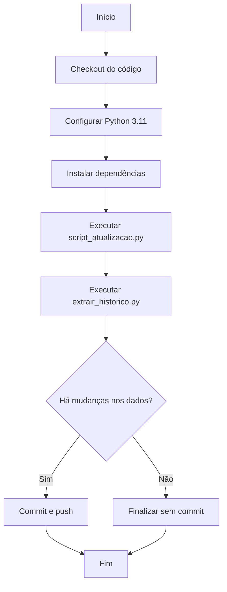

# ⚙️ GitHub Actions - Configuração

Este diretório contém os workflows do GitHub Actions para automação do projeto.

## 📋 Workflow: Atualizar Dados Jira

**Arquivo:** `atualizar_dados.yml`

### ⏰ Horários de Execução Automática

O workflow executa automaticamente em dias úteis (segunda a sexta) nos seguintes horários:

| Horário UTC | Horário BRT | Descrição           |
| ----------- | ----------- | ------------------- |
| 08:00       | 05:00       | Início do dia       |
| 13:00       | 10:00       | Meio da manhã       |
| 17:00       | 14:00       | Início da tarde     |
| 19:00       | 16:00       | Final do expediente |

### 🔐 Configuração de Secrets

Para que o workflow funcione, você precisa configurar os seguintes secrets no GitHub:

1. Acesse o repositório no GitHub
2. Vá em **Settings → Secrets and variables → Actions**
3. Clique em **New repository secret**
4. Adicione os seguintes secrets:

#### JIRA_EMAIL

- **Nome:** `JIRA_EMAIL`
- **Valor:** Seu email do Jira (ex: `seu.email@exemplo.com`)

#### JIRA_API_TOKEN

- **Nome:** `JIRA_API_TOKEN`
- **Valor:** Seu token de API do Jira

**Como obter o token do Jira:**

1. Acesse: https://id.atlassian.com/manage-profile/security/api-tokens
2. Clique em **Create API token**
3. Dê um nome (ex: "GitHub Actions")
4. Copie o token gerado

### ▶️ Execução Manual

Você pode executar o workflow manualmente a qualquer momento:

1. Acesse o repositório no GitHub
2. Vá em **Actions**
3. Selecione **Atualizar Dados Jira**
4. Clique em **Run workflow**
5. Confirme clicando em **Run workflow** novamente

### 📊 O que o Workflow Faz



### 📦 Arquivos Atualizados

O workflow atualiza automaticamente os seguintes arquivos:

- `dados/FASE_3.csv` - Dados consolidados do projeto BF3E4
- `dados/historico/*.csv` - Histórico de mudanças por Data-Lake

### 🚀 Melhorias Implementadas

- ✅ **Cache de dependências**: Uso de cache do pip para builds mais rápidos
- ✅ **Commits inteligentes**: Só commita se houver mudanças reais
- ✅ **Timestamp**: Mensagens de commit incluem data/hora da atualização
- ✅ **Skip CI**: Tag `[skip ci]` evita loops infinitos de builds
- ✅ **Logs informativos**: Mensagens claras sobre o status da execução

### 🔍 Verificando Execuções

Para ver o histórico de execuções:

1. Acesse **Actions** no repositório
2. Selecione **Atualizar Dados Jira**
3. Veja lista de execuções com status (sucesso ✅, falha ❌, em execução 🔄)
4. Clique em qualquer execução para ver logs detalhados

### ⚠️ Troubleshooting

**Problema: Workflow não executa automaticamente**

- Verifique se o repositório não está arquivado
- Confirme que os secrets estão configurados
- Verifique se há commits recentes (GitHub desativa workflows em repos inativos)

**Problema: Erro de autenticação no Jira**

- Verifique se `JIRA_EMAIL` está correto
- Confirme se `JIRA_API_TOKEN` é válido e não expirou
- Teste as credenciais localmente primeiro

**Problema: Erro ao fazer push**

- Verifique se o token `GITHUB_TOKEN` tem permissões de escrita
- Confirme que a branch não está protegida por regras restritivas

### 📝 Customização

Para alterar os horários de execução, edite o arquivo `atualizar_dados.yml`:

```yaml
on:
  schedule:
    - cron: "0 8 * * 1-5" # Minuto Hora DiaMês Mês DiaSemana
```

Formato cron:

- Minuto: 0-59
- Hora: 0-23 (UTC)
- Dia do mês: 1-31
- Mês: 1-12
- Dia da semana: 0-6 (0 = Domingo, 1-5 = Seg-Sex)

### 🔗 Links Úteis

- [Documentação GitHub Actions](https://docs.github.com/en/actions)
- [Sintaxe de Cron](https://crontab.guru/)
- [Jira REST API](https://developer.atlassian.com/cloud/jira/platform/rest/v3/)
